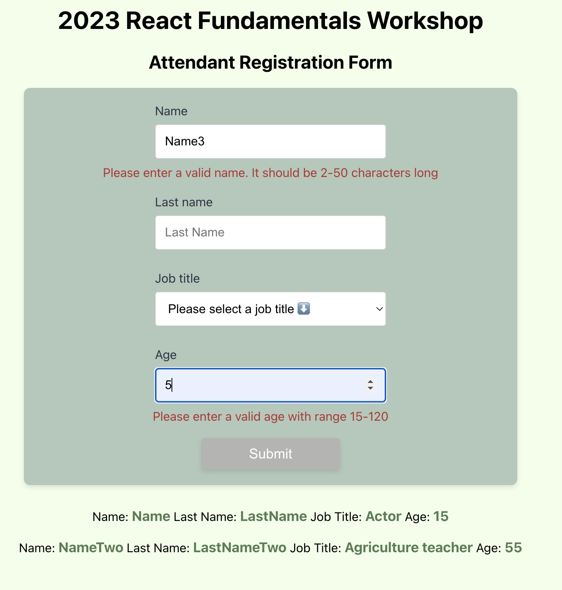

# Attendant registration form

This app is a simple attendant registration form which allows to submit attendant data and displays the submitted data sorted by age in ascending order . The app is built using React. The app uses a mock database to fetch job titles and to post the submitted data. The app also uses a mock api to fetch attendants data. The app is responsive and has been tested on various browsers.

Attendant registration form input values has validations for form fiels. The form fields are validated on submit, on blur and on change.

Each Component has unit tests using jest and react-testing-library.

## Getting started

1. `npm i`
2. `npm start`

## Tasks

- [x] Create an attendant form which has the following fields:
- Name (name);
- Last name (lastName);
- Job title (selected from a job title list which is fetched from a mock database) (jobTitle);
- Age (age);
- [x] On submit, display the submitted attendant data in the page and clear form.
- [x] Allow multiple submissions.
- [x] Show job titles in a sorted order.
- [x] Show attendants sorted by age in ascending order.
- [x] Show loading state (loader) for all api calls.
- [x] Disable submit button until api call is resolved.
- [x] Bonus: add error messages for form fields.
- [x] Bonus: add touched states for form fields.
- [x] Added additionally: unit tests for the components using jest and react-testing-library.

## Visuals:

